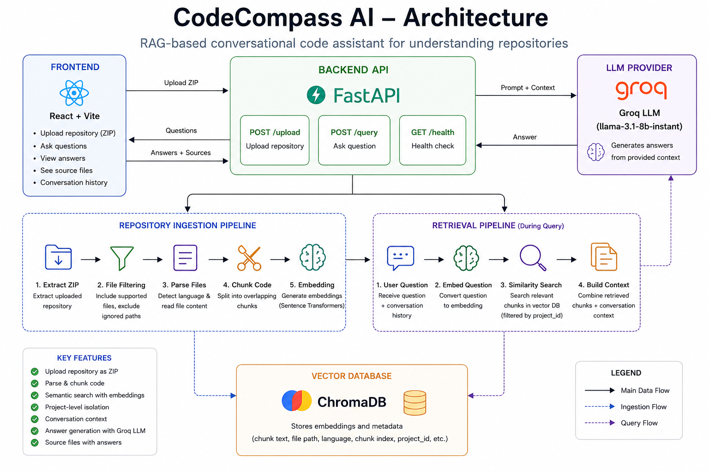

# CodeCompass AI

## 1. Introduction

CodeCompass AI is a conversational code documentation assistant.

It allows users to upload a software repository as a ZIP file and ask questions about the codebase, such as where functionality is implemented, what dependencies are used, and how different parts of the repository work.

The application uses a Retrieval-Augmented Generation (RAG) approach. The uploaded repository is parsed and divided into code chunks, the chunks are converted into embeddings and stored in a vector database, and relevant chunks are retrieved when the user asks a question. The retrieved code context is then provided to an LLM to generate the answer.

The goal of the project is to provide a simple interface for understanding an unfamiliar codebase while keeping the implementation modular, testable, and easy to extend.

## 2. Features

- Upload a software repository as a ZIP file
- Extract and parse supported source and text files
- Detect programming languages from file extensions
- Split large files into overlapping chunks
- Generate semantic embeddings for repository chunks
- Store embeddings and metadata in ChromaDB
- Retrieve relevant code chunks using semantic similarity
- Isolate retrieval by project ID
- Ask questions about the uploaded repository
- Maintain recent conversation context for follow-up questions
- Generate answers using an LLM through Groq
- Display source files associated with retrieved context
- Validate query requests and reject empty questions or project IDs
- Provide a FastAPI Swagger/OpenAPI interface
- Provide a React web interface for repository upload and conversation

## 3. Architecture

CodeCompass AI follows a Retrieval-Augmented Generation (RAG) architecture. The system consists of a React/Vite frontend, FastAPI backend, repository ingestion pipeline, retrieval pipeline, ChromaDB vector store, and Groq-hosted LLM.



### Main components

#### Frontend

The frontend is implemented with React and Vite. It provides the interface for uploading repositories, asking questions, maintaining conversation context, and displaying answers with their source files.

#### Backend API

The backend is implemented with FastAPI and provides endpoints for repository upload, health checking, and repository questions.

#### Repository ingestion

Uploaded repositories are processed through the following pipeline:

````text
ZIP → File filtering → Repository parsing → Code chunking → Embeddings → ChromaDB

## 4. Project Structure

The project is organized into separate frontend and backend applications.

```text
codecompass-ai/
├── backend/
│   ├── app/
│   │   ├── api/
│   │   │   ├── health.py
│   │   │   ├── query.py
│   │   │   └── upload.py
│   │   │
│   │   ├── ingestion/
│   │   │   ├── file_loader.py
│   │   │   ├── repository_parser.py
│   │   │   └── code_chunker.py
│   │   │
│   │   ├── retrieval/
│   │   │   ├── embedding_service.py
│   │   │   ├── llm_service.py
│   │   │   ├── prompt_builder.py
│   │   │   ├── retrieval_service.py
│   │   │   └── vector_store.py
│   │   │
│   │   ├── services/
│   │   │   ├── indexing_service.py
│   │   │   └── upload_service.py
│   │   │
│   │   └── main.py
│   │
│   ├── tests/
│   │   ├── test_chunker.py
│   │   ├── test_health.py
│   │   ├── test_parser.py
│   │   ├── test_query.py
│   │   └── test_retrieval.py
│   │
│   ├── requirements.txt
│   └── pytest.ini
│
├── frontend/
│   ├── src/
│   │   ├── assets/
│   │   ├── App.jsx
│   │   ├── App.css
│   │   ├── index.css
│   │   └── main.jsx
│   ├── public/
│   ├── package.json
│   ├── package-lock.json
│   └── vite.config.js
│
├── docs/
│   └── images/
│       └── architecture.png
│
├── .gitignore
└── README.md

## 5. Setup and Installation

### Prerequisites

The project requires:

- Python 3.12 or compatible Python 3 version
- Node.js and npm
- A Groq API key

### Backend setup

From the project root:

```bash
cd backend
python3 -m venv .venv
source .venv/bin/activate

Install the Python dependencies:
pip install -r requirements.txt

Create the environment file:
cp .env.example .env

Open .env and add your Groq API key:
GROQ_API_KEY=your_groq_api_key_here

The application uses llama-3.1-8b-instant as the default Groq model.
Start the FastAPI backend:
uvicorn app.main:app --reload --port 8001

The backend will be available at:
http://localhost:8001

FastAPI's interactive API documentation is available at:
http://localhost:8001/docs

Frontend setup
Open another terminal:
cd frontend
npm install
npm run dev

Vite will display the frontend development URL in the terminal.
Using the application
Once both services are running:
Open the frontend in a browser.
Upload a repository ZIP file.
Wait for the repository to be indexed.
Ask a question about the repository.
Review the generated answer and the returned source files.
Running the tests
From the backend directory with the virtual environment activated:
pytest -v

The current backend test suite contains 12 tests covering repository parsing, chunking, retrieval, project isolation, API validation, and the health endpoint.
The current test result is:
12 passed, 1 warning

## 6. RAG Approach and Decisions

CodeCompass AI uses a Retrieval-Augmented Generation (RAG) pipeline to answer questions about uploaded software repositories.

Instead of sending the entire repository to the LLM, the system first retrieves the most relevant code chunks for the user's question. These chunks are then provided to the LLM as context for generating the answer.

The overall RAG pipeline is:

```text
Repository
    ↓
File parsing
    ↓
Code chunking
    ↓
Embedding generation
    ↓
ChromaDB
    ↓
Question embedding
    ↓
Similarity search
    ↓
Relevant code chunks
    ↓
Prompt construction
    ↓
Groq LLM
    ↓
Answer + Sources

6.1 Repository ingestion
When a repository ZIP file is uploaded, it is extracted and processed by the repository ingestion pipeline.
The parser recursively searches the extracted repository and processes supported text and source files.
The implementation currently recognizes common programming languages and formats including:
Python
JavaScript
JSX
TypeScript
TSX
Java
C/C++
C#
Go
Rust
PHP
Ruby
Swift
Kotlin
Markdown
JSON
YAML
TOML
XML
Plain text
Unsupported files and ignored paths are skipped during ingestion.
6.2 Chunking strategy
Large repository files are split into overlapping chunks.
The current configuration is:
Chunk size: 1200 characters
Overlap:    200 characters

Files smaller than the chunk size remain as a single chunk.
The overlap is used to preserve some surrounding context between adjacent chunks. This is useful when a relevant piece of code is close to a chunk boundary.
Each chunk receives a deterministic ID generated from:
project_id + file_path + chunk_index

This provides stable identifiers for the same repository content.
Why character-based chunking?
A character-based strategy was chosen for the initial implementation because it is simple, predictable, and works across multiple programming languages without requiring a different parser for each language.
However, it does not understand programming-language structure. A function or class can therefore be split across chunks.
A future version could use syntax-aware or AST-based chunking so that functions, classes, and other logical code units are kept together.
6.3 Embedding model
The application uses:
sentence-transformers/all-MiniLM-L6-v2

for both document and query embeddings.
Repository chunks are embedded during indexing, while the user's question is embedded during retrieval.
The embeddings are normalized before being stored or queried.
The model was selected because it is lightweight, easy to run locally, and provides a practical balance between retrieval quality and computational cost for an MVP.
A future implementation could evaluate code-specific embedding models against a repository-question benchmark to determine whether they provide better retrieval performance.
6.4 Vector store
ChromaDB is used as the vector database.
Each stored chunk includes metadata such as:
project_id
file_path
language
chunk_index

The actual chunk content and its embedding are also stored.
The project_id is particularly important because it allows retrieval to be restricted to the repository associated with the current question.
For example:
Query for Project A
        ↓
ChromaDB
        ↓
project_id = Project A
        ↓
Relevant chunks from Project A only

This prevents chunks from different uploaded repositories from being mixed during retrieval.
6.5 Retrieval strategy
When a question is submitted, the system:
Creates an embedding for the question.
Searches ChromaDB for semantically similar chunks.
Filters the search using the current project_id.
Returns the top relevant chunks.
Uses those chunks as context for the LLM.
The current default retrieval value is:
top_k = 5

The retrieval service returns the retrieved content together with metadata such as file path, language, project ID, chunk index, and distance.
6.6 Conversational retrieval
The query API accepts previous conversation messages.
The backend keeps the most recent six messages and combines them with the current question when constructing the retrieval query.
Conceptually:
Previous conversation
        +
Current question
        ↓
Retrieval query
        ↓
Semantic search

This allows follow-up questions to use the context of the previous conversation instead of treating every question as completely independent.
The current implementation intentionally limits the conversation history to avoid continuously increasing the amount of context sent through the retrieval pipeline.
6.7 Prompt construction
After retrieval, the selected chunks are formatted with their repository metadata.
The context contains information such as:
File: path/to/file.py
Language: python
Content:
<retrieved code>

Multiple retrieved chunks are separated before being passed to the prompt builder.
The final prompt contains the user's current question together with the retrieved repository context.
6.8 LLM
The application uses the Groq API for answer generation.
The default model configured by the backend is:
llama-3.1-8b-instant

The LLM is given the retrieved repository context rather than the complete repository.
The generation temperature is currently set to:
0.1

A low temperature was chosen because repository questions generally benefit from more consistent and less creative responses.
6.9 Source attribution
The API response includes the files associated with the retrieved chunks.
Each source contains:
file_path
language
distance

The frontend displays these sources below the generated answer.
This provides the user with a direct indication of which repository files contributed to the retrieved context.
6.10 Current RAG limitations
The current RAG implementation is intentionally simple.
It does not currently include:
syntax-aware chunking
hybrid keyword and semantic retrieval
a dedicated reranking stage
query rewriting
retrieval confidence thresholds
automated RAG evaluation
code-specific embedding benchmarking
These are potential improvements for a production-oriented version of the system.

## 7. Prompt and Context Management

The prompt construction process is designed to provide the LLM with relevant repository context without sending the entire repository.

When a user asks a question, the system first retrieves relevant code chunks from ChromaDB. These chunks are then combined with the current question and passed to the prompt builder.

The overall process is:

```text
User question
      ↓
Conversation context
      ↓
Retrieval query
      ↓
Relevant repository chunks
      ↓
Prompt builder
      ↓
LLM
      ↓
Generated answer

Conversation context
The query API accepts conversation history using the following structure:
role
content

The backend keeps the most recent six messages:
recent_context = conversation[-6:]

These messages are converted into text and combined with the current question when constructing the retrieval query.
This allows the system to support follow-up questions while limiting the amount of previous conversation included in the retrieval process.
Retrieved repository context
After semantic retrieval, each selected chunk is formatted with its metadata:
File: <file path>
Language: <language>
Content:
<retrieved code>

Multiple retrieved chunks are separated before being passed to the prompt builder.
This gives the LLM information about both the content and its location within the repository.
Separation of retrieval and generation
The system keeps retrieval and answer generation as separate stages.
The retrieval service is responsible for finding relevant repository chunks, while the prompt builder is responsible for constructing the context supplied to the LLM.
This separation makes it possible to change the retrieval strategy or prompt design independently.
Context size
The current implementation limits conversational context to the six most recent messages and retrieves a maximum of five chunks by default.
This keeps the prompt relatively small while still providing enough repository and conversational context for the current MVP.
For a production system, the context limits could be adjusted based on the selected LLM's context window and evaluated using representative repository questions.
Answer sources
The retrieved chunks are also used to construct the source information returned by the API.
For each source, the API provides:
file_path
language
distance

The frontend displays these source files together with the generated answer.
This makes the response more transparent by showing which parts of the repository were involved in the retrieval process.

### One important distinction

Notice that we're **not claiming the LLM receives the conversation separately from the retrieval process**.

In your current implementation, the previous conversation is used to create:

```text
retrieval_query

while the prompt builder receives:
question
context

## 8. Guardrails and Quality Controls

The current implementation includes several basic validation and isolation mechanisms to improve reliability and prevent common errors.

### Input validation

The query API validates both the project ID and question before processing the request.

Both fields must contain at least one character.

For example:

```text
Empty question  → rejected
Empty project ID → rejected

These checks are implemented using Pydantic request validation.
Repository file filtering
During repository ingestion, the parser processes only supported files and skips files or paths that should be ignored.
This prevents unnecessary binary files, generated files, and other unsupported content from entering the retrieval pipeline.
Project-level retrieval isolation
Each repository is assigned a project_id.
The project ID is stored as metadata with every indexed chunk.
When a question is submitted, ChromaDB retrieval is explicitly filtered using the current project ID:
Question
   ↓
Embedding
   ↓
ChromaDB search
   ↓
project_id filter
   ↓
Relevant chunks from the selected repository

This prevents retrieval results from being mixed between different uploaded repositories.
The behavior is covered by an automated test:
test_retrieval_is_isolated_by_project

Deterministic chunk identifiers
Each chunk receives a stable identifier generated from:
project_id + file_path + chunk_index

The value is hashed using SHA-256.
This provides deterministic identifiers for chunks and prevents different chunks from accidentally receiving the same identifier within the same project.
Source attribution
The query response includes the file path and language of each retrieved source.
This allows the user to see which repository files contributed to the answer.
The frontend displays these sources below the generated response.
Error handling
The query endpoint catches unexpected errors during retrieval or LLM generation and returns an HTTP 500 response with a generic error message.
The implementation avoids exposing internal exception details directly through the API response.
Current limitations
The current MVP does not yet implement more advanced RAG quality controls such as:
retrieval confidence thresholds
reranking
hallucination detection
answer verification against source code
automated faithfulness evaluation
authentication and authorization
rate limiting
malicious repository scanning
These would be important additions for a production deployment.

### Why this section matters

This is actually a good section for your assignment because we're showing that **you thought about reliability**, while being honest about what is and isn't implemented.

And we have evidence for the project-isolation part because you already ran:

```text
test_retrieval_is_isolated_by_project PASSED

and the full suite is:
12 passed, 1 warning

## 9. Testing

The backend includes automated tests using `pytest`. The tests focus on the main stages of the application: repository parsing, code chunking, retrieval, API behavior, and project isolation.

### Test coverage

The current test suite covers:

#### Repository parsing

Tests verify that supported repository files can be discovered and parsed correctly.

```text
tests/test_parser.py

Code chunking
The chunker tests cover:
Small files remaining as a single chunk
Stable chunk identifiers
Different chunks receiving different identifiers
Creation of overlapping chunks for large files
Rejection of invalid overlap configuration
tests/test_chunker.py

Health endpoint
The FastAPI health endpoint is tested to verify that the backend is responding correctly.
tests/test_health.py

Repository query API
The query endpoint is tested for:
Successful repository questions
Empty questions being rejected
Empty project IDs being rejected
tests/test_query.py

Retrieval
The retrieval service is tested to verify that relevant chunks can be retrieved from the vector store.
Project-level isolation is also tested to ensure that a query for one project does not retrieve chunks belonging to another project.
tests/test_retrieval.py

Running the tests
From the backend directory:
source .venv/bin/activate
pytest -v

Current test result
The complete test suite currently produces:
12 passed, 1 warning

The tests completed successfully with no test failures.
The current warning comes from the Starlette/FastAPI test client dependency and does not cause any test to fail.
Testing approach
The project uses a combination of focused tests and a complete test-suite run.
During development, individual components were tested separately before running the complete suite. This helped identify problems in repository parsing, chunking, retrieval, API validation, and project isolation independently.
The final full-suite run is used as a regression check after integrating the components.

## 10. Key Technical Decisions

The implementation was designed around simplicity, modularity, and the ability to replace individual components as the system evolves.

### FastAPI for the backend

FastAPI was selected for the backend because the application is primarily an API-driven system.

It provides:

- Request validation through Pydantic
- Clear API routing
- Automatic OpenAPI documentation
- Interactive Swagger UI
- Straightforward integration with Python-based AI and retrieval libraries

This makes it suitable for connecting the frontend with the repository ingestion and RAG pipeline.

### React and Vite for the frontend

The frontend uses React with Vite.

The application requires a relatively simple interface: repository upload, conversational questions, generated answers, and source display.

React provides the component-based UI structure, while Vite provides a lightweight development and build environment without introducing unnecessary frontend complexity.

### Sentence Transformers for embeddings

The application uses `sentence-transformers/all-MiniLM-L6-v2` for embeddings.

The main reason for this choice was its balance between:

- Semantic representation quality
- Local execution
- Low computational requirements
- Simple integration with the Python backend

The same embedding model is used for both repository chunks and user queries so that they can be compared in the same vector space.

### ChromaDB for vector storage

ChromaDB was selected as the vector store for the MVP because it provides a simple persistent vector database that can be integrated directly into the Python application.

It also supports storing metadata alongside embeddings.

The metadata is important for CodeCompass because each chunk stores information such as:

```text
project_id
file_path
language
chunk_index
````

This allows retrieval to be restricted to a specific repository.

For a production deployment with many users and repositories, a managed or distributed vector database would be considered instead.

### Character-based chunking

The current chunker uses a fixed character-based strategy:

```text
Chunk size: 1200 characters
Overlap: 200 characters
```

This approach was chosen because the system needs to support multiple programming languages without implementing a separate syntax parser for every language.

The trade-off is that character-based chunking does not understand code structure. A function or class can potentially be split between two chunks.

A syntax-aware chunking strategy would therefore be a future improvement.

### Groq for LLM inference

The application uses Groq for LLM inference, with:

```text
llama-3.1-8b-instant
```

as the default model.

Using an external inference provider avoids requiring a large local language model and GPU infrastructure for the MVP.

The LLM service is isolated in its own module, which means the provider or model can be replaced without changing the rest of the retrieval pipeline.

### Low generation temperature

The LLM generation temperature is set to:

```text
0.1
```

A low temperature was selected because the task is primarily factual codebase question answering rather than creative text generation.

The goal is to encourage more consistent responses based on the retrieved repository context.

### Project-based data isolation

Every indexed chunk contains a `project_id`.

Queries are filtered using that identifier before results are returned.

This was an explicit design decision because multiple repositories can be uploaded to the same application. Without project-level filtering, semantically similar code from another repository could potentially be returned.

Project isolation is also covered by an automated retrieval test.

### Modular service design

The backend separates major responsibilities into individual modules:

```text
Repository parsing
       ↓
Code chunking
       ↓
Embedding generation
       ↓
Vector storage
       ↓
Retrieval
       ↓
Prompt construction
       ↓
LLM generation
```

This makes individual components easier to test and replace.

For example, the embedding model can be changed without rewriting the vector store or API layer, and the LLM provider can be changed without changing the repository parser.

### Why this architecture for the MVP?

The main design goal was to get a complete and testable RAG workflow working before adding more complex infrastructure.

The current architecture therefore favors:

- Simple local development
- Clear separation of responsibilities
- Testability
- Replaceable AI components
- Repository-level isolation

More advanced infrastructure can be introduced when the system needs to support larger repositories, more users, and production workloads.

## 11. Engineering Standards

The project follows a modular structure so that repository ingestion, retrieval, LLM generation, and API functionality can be developed and tested independently.

### Separation of responsibilities

The backend separates the main application responsibilities into different modules:

- Repository parsing and file loading
- Code chunking
- Embedding generation
- Vector storage and retrieval
- Prompt construction
- LLM generation
- Repository upload and indexing
- API endpoints

This makes individual components easier to understand, test, and replace.

### Input validation

FastAPI request models validate incoming query requests.

The query API rejects requests with an empty:

- `project_id`
- `question`

This prevents invalid requests from entering the retrieval pipeline.

### Deterministic identifiers

Code chunks use deterministic SHA-256 identifiers generated from the project ID, file path, and chunk index.

This provides stable identifiers for the same chunk and helps avoid accidental identifier collisions.

### Environment-based secrets

The Groq API key is loaded from an environment variable:

````text
GROQ_API_KEY

The actual .env file is excluded from version control. A .env.example file is provided so that the required configuration is clear without exposing the secret.
Testing
The backend includes automated tests for the main application components.
The current test suite contains 12 tests covering:
Repository parsing
Code chunking
Chunk ID generation
API validation
Health checking
Retrieval
Project isolation
The complete test suite currently passes successfully.
Version control hygiene
Generated and environment-specific files are excluded from Git, including:
.env
Python virtual environments
Node.js dependencies
Generated repository storage
Runtime vector database data
Frontend build output
Python cache files
This keeps the repository focused on source code, configuration examples, tests, documentation, and other files required to reproduce the application.
API documentation
FastAPI automatically provides OpenAPI documentation and Swagger UI for the backend API.
This makes the available endpoints and request/response models easier to inspect during development and testing.
Current engineering scope
The project is an MVP rather than a production deployment. Practices such as authentication, rate limiting, distributed tracing, CI/CD, automated dependency updates, and production monitoring are not currently implemented and are discussed as future production requirements.

## 12. Productionization and Scaling

For production, I would keep the current separation between the frontend, API, ingestion, retrieval, and LLM layers, but replace the local MVP components with scalable infrastructure.

```text
                         Users
                           │
                           ▼
                    ┌───────────────┐
                    │ Load Balancer │
                    └───────┬───────┘
                            │
                ┌───────────┴───────────┐
                ▼                       ▼
          Frontend / CDN          FastAPI instances
                                        │
                         ┌──────────────┼──────────────┐
                         ▼              ▼              ▼
                  Object Storage     Job Queue      Vector DB
                  repositories       ingestion       retrieval
                                         │
                                         ▼
                                  Worker instances
                                         │
                                  Parse → Chunk
                                         │
                                      Embed
                                         │
                                         ▼
                                    Vector DB
                                         │
                                         ▼
                                    LLM Provider
````

### Containerization

The current submission does not include Docker configuration. For production, I would containerize the backend and frontend so that the application can be deployed consistently across development, testing, and cloud environments.

The backend could run as a stateless container behind a load balancer, while repository ingestion could run as separate worker containers.

### Repository storage

The current MVP stores uploaded repositories locally.

For production, uploaded ZIP files should be stored in object storage such as Amazon S3, Google Cloud Storage, or Azure Blob Storage.

The application database would store metadata such as:

```text
project_id
repository location
upload status
created_at
indexing status
```

### Asynchronous ingestion

Repository indexing should not block an HTTP request for large repositories.

A production workflow could be:

```text
Upload
   ↓
Object Storage
   ↓
Job Queue
   ↓
Background Worker
   ↓
Parse
   ↓
Chunk
   ↓
Embed
   ↓
Vector Database
   ↓
Indexing complete
```

The API could return a project ID and indexing status immediately. The frontend could then display the indexing progress or wait until the repository is ready for questions.

### Horizontal API scaling

The FastAPI layer should remain stateless so that multiple API instances can run behind a load balancer.

Shared state such as repository metadata, uploaded files, and vector data should not depend on the local filesystem of an individual API instance.

### Vector database

The current ChromaDB setup is suitable for the MVP and local development.

For production, I would evaluate a managed or distributed vector database based on repository size, number of users, query volume, availability requirements, and operational cost.

The retrieval interface in the application is already separated from the API layer, which makes replacing the underlying vector store easier.

### Embedding workers

Embedding generation can become expensive when users upload large repositories.

Embedding generation should therefore be performed by background workers that can scale independently from the API servers.

Workers could process repository chunks in batches to improve throughput.

### Caching

Caching could reduce repeated computation.

Potential caching opportunities include:

- Repository indexing results
- Embeddings for unchanged files
- Frequently repeated queries
- Frequently retrieved chunks

Repository content could also be identified by a content hash so that unchanged files do not need to be embedded again.

### Observability

A production deployment should collect both infrastructure and RAG-specific metrics.

Examples include:

- API request latency
- Upload failures
- Indexing duration
- Number of processed files
- Number of generated chunks
- Embedding latency
- Retrieval latency
- LLM latency
- LLM token usage
- Query error rate
- Retrieval results
- Indexing job failures

Structured logs and request IDs would make it easier to trace a question through the API, retrieval, and LLM stages.

### Security

A production version should additionally include:

- User authentication
- Authorization and project ownership checks
- Upload size limits
- Secure ZIP extraction
- Repository isolation between users
- Rate limiting
- Secret management
- Encrypted storage
- Malware/security scanning for uploaded repositories

### Cloud deployment

The architecture could be deployed on AWS, Azure, or GCP.

For example, an AWS deployment could use:

```text
CloudFront / CDN
       ↓
Frontend hosting
       ↓
Load Balancer
       ↓
FastAPI containers
       ↓
Queue + Worker containers
       ↓
S3 + Managed Vector Database
       ↓
Groq LLM API
```

The exact cloud services would depend on the expected traffic, repository size, operational requirements, and budget.

### Scaling priority

I would prioritize production improvements in this order:

1. Move uploaded repositories to object storage.
2. Make repository indexing asynchronous.
3. Containerize the application.
4. Use a production-grade shared vector database.
5. Make the API horizontally scalable.
6. Add authentication and project authorization.
7. Add structured logging and monitoring.
8. Add RAG quality evaluation and performance monitoring.

## 13. Limitations

The current implementation is a functional MVP and has several limitations that would need to be addressed before production deployment.

### Repository size

The current ingestion pipeline processes repositories locally. Very large repositories could require significant processing time and memory.

A production implementation would use asynchronous background workers and object storage for larger repositories.

### Character-based chunking

The current chunking strategy is based on a fixed character size rather than the structure of the programming language.

This means that functions, classes, or other logical code units can potentially be split across chunks.

Syntax-aware or AST-based chunking could provide better code context.

### Embedding model

The current system uses `all-MiniLM-L6-v2`, which is a general-purpose sentence embedding model rather than a model specifically optimized for source code.

A future version should compare code-oriented embedding models using a representative set of repository questions.

### Retrieval quality

The current retrieval pipeline performs semantic similarity search using ChromaDB.

It does not currently include:

- Hybrid keyword and semantic retrieval
- A dedicated reranking stage
- Query rewriting
- Retrieval confidence thresholds
- Multiple retrieval strategies

These techniques could improve the relevance of the context supplied to the LLM.

### LLM limitations

The generated answer depends on the quality of the retrieved context and the behavior of the selected LLM.

The current implementation does not automatically verify that every claim in the generated answer is supported by the repository.

Source files are returned with the response, but the system does not yet provide line-level citations.

### RAG evaluation

The current automated tests verify application behavior such as parsing, chunking, retrieval, project isolation, and API validation.

They do not constitute a comprehensive evaluation of RAG answer quality.

A production-oriented evaluation should include a benchmark containing questions, expected relevant files or code sections, retrieval metrics, and answer-quality or faithfulness measurements.

### Conversation context

The current implementation keeps only the six most recent conversation messages.

This keeps the retrieval query manageable, but important information from an older part of a long conversation may no longer be available.

A future implementation could use conversation summarization or persistent conversation memory.

### Local vector storage

The current ChromaDB configuration uses local persistent storage.

This is convenient for development and the MVP, but it is not sufficient by itself for highly available multi-instance production deployment.

### Security

The current MVP does not implement user authentication, authorization, rate limiting, or repository malware scanning.

These would be required before allowing untrusted users to upload repositories in a public production service.

### Deployment

The current project does not include Docker or cloud deployment configuration.

The application can be run locally using the documented backend and frontend setup. Containerization and cloud deployment are described as production improvements rather than being presented as implemented features.

## 14. AI-Assisted Development

AI-assisted coding tools were used during development for implementation support, debugging, code review, and generating ideas for tests and improvements.

AI-generated suggestions were not treated as automatically correct. Changes were reviewed, implemented, tested, and adjusted based on the behavior of the application.

The development process generally followed this workflow:

````text
Define implementation task
        ↓
Implement or modify code
        ↓
Run the application/tests
        ↓
Inspect errors or unexpected behavior
        ↓
Fix and refine
        ↓
Run regression tests


### Step 15 — What I Would Do Differently

```markdown
## 15. What I Would Do Differently

With more development time, I would focus first on improving retrieval quality and production reliability.

### Improve code-aware chunking

I would replace the current character-based chunking approach with syntax-aware chunking based on functions, classes, modules, and other logical code structures.

### Evaluate embedding models

I would create a benchmark of representative repository questions and compare several embedding models based on retrieval relevance rather than selecting a model only from general-purpose benchmarks.

### Improve retrieval

I would evaluate hybrid search, reranking, and query rewriting to improve the relevance of retrieved code.

### Add RAG evaluation

I would create an evaluation dataset containing questions, expected relevant files, and expected answer characteristics.

This would allow changes to the embedding, retrieval, chunking, and prompting stages to be measured objectively.

### Improve production architecture

I would move repository storage to object storage, make indexing asynchronous, containerize the application, and use scalable shared infrastructure for vector storage.

### Improve security and observability

I would add authentication, authorization, rate limiting, secure archive processing, structured logging, monitoring, and distributed tracing before exposing the application to untrusted users.

These changes would allow the system to move from a functional MVP toward a reliable production service.

## 16. Summary

CodeCompass AI provides a conversational interface for asking questions about software repositories.

The implementation combines:

```text
React + Vite
      ↓
FastAPI
      ↓
Repository ingestion
      ↓
Code chunking
      ↓
Sentence Transformers
      ↓
ChromaDB
      ↓
Semantic retrieval
      ↓
Groq LLM
      ↓
Answer + Sources


### Finally — Author & Copyright

Put this **after Section 16**:

## Author

**Degefom Kahsay Berhe**

CodeCompass AI was designed and developed as an individual software engineering project.

## Copyright

Copyright © 2026 Degefom Kahsay Berhe. All rights reserved.

This repository is provided for evaluation and demonstration purposes. No license is granted for redistribution, modification, or commercial use unless explicitly stated by the author.


````
